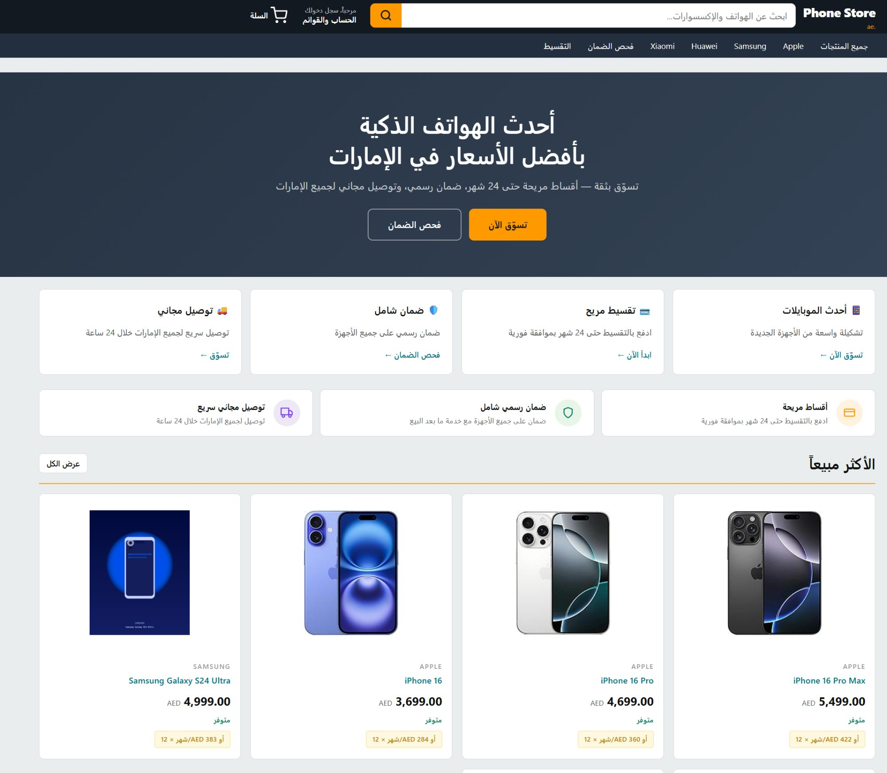
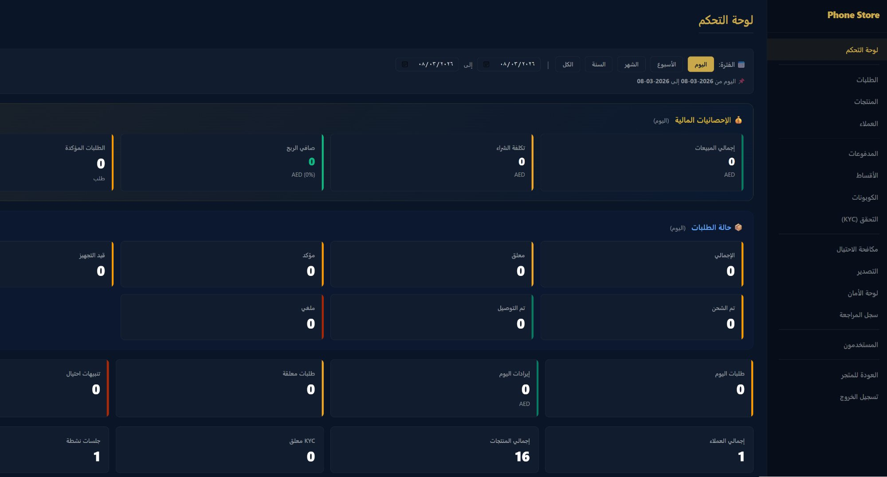
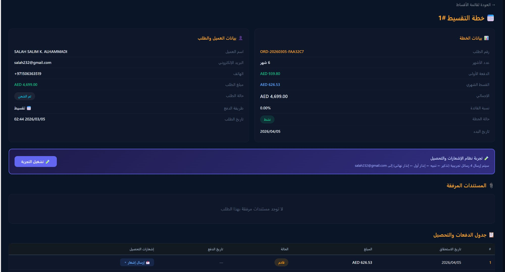
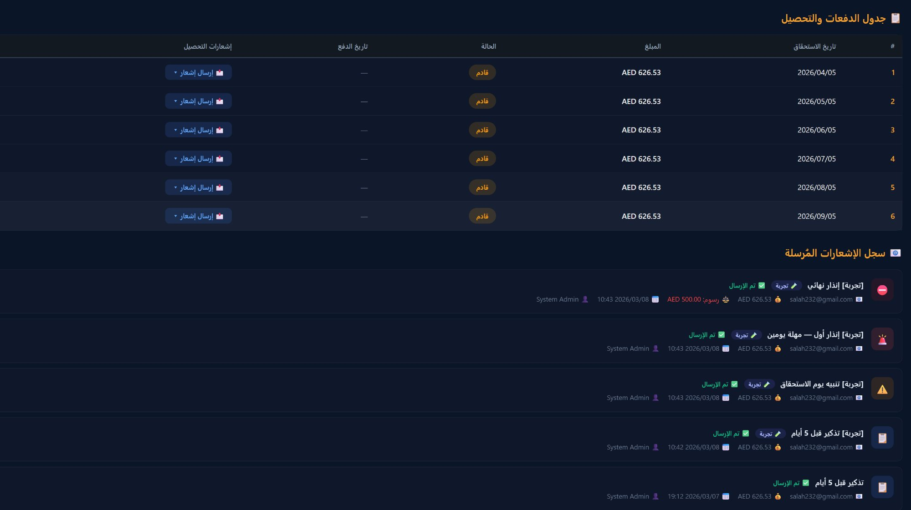

# Phone Store — نظام متجر الهواتف بالتقسيط


نظام متجر إلكتروني متكامل لبيع الهواتف الذكية بالتقسيط في الإمارات العربية المتحدة.  
مبني على PHP MVC خالص بدون frameworks خارجية، مع لوحة تحكم إدارية متكاملة.

---

## 📸 لقطات النظام

### الصفحة الرئيسية للمتجر
> عرض المنتجات، الفئات، وخيارات التقسيط بواجهة RTL عربية كاملة



---

### لوحة التحكم الإدارية
> إحصائيات مالية لحظية — المبيعات، الربح، تكلفة الشراء، وحالة الطلبات



---

### تفاصيل خطة التقسيط
> عرض كامل لبيانات العميل، بيانات الطلب، خطة السداد، ونسبة الفائدة



---

### جدول الدفعات وسجل الإشعارات
> جدول الأقساط الشهرية مع نظام إرسال إشعارات تلقائية (تذكير، إنذار، إنذار نهائي)



---

## ✨ المميزات الرئيسية

- **واجهة عربية كاملة** — RTL، دعم AED، تصميم متجاوب
- **نظام التقسيط** — خطط مرنة حتى 24 شهر بموافقة فورية
- **لوحة تحكم إدارية** — إحصائيات مالية، إدارة الطلبات، العملاء، المنتجات
- **إشعارات تلقائية** — تذكير → إنذار أول → إنذار نهائي عبر البريد
- **نظام KYC** — التحقق من هوية العميل قبل التقسيط
- **أمان متكامل** — CSRF، CSP، Session Hardening، Rate Limiting، Audit Log

---

## 🔐 طبقات الأمان

| الطبقة | التطبيق |
|--------|---------|
| Sessions | HTTPOnly, SameSite=Strict, Idle Timeout, Fingerprint |
| CSRF | Token ثابت الوقت، Origin/Referer Validation |
| CSP | Nonce لكل Request، بدون unsafe-inline |
| Rate Limiting | حد IP على Login/Register |
| Account Lockout | قفل بعد 5 محاولات فاشلة |
| Audit Log | تسجيل جميع أحداث الأمان |
| SQL | PDO Prepared Statements فقط |
| XSS | htmlspecialchars() على كل output |

---

## 🚀 التثبيت

```bash
git clone https://github.com/salah23222/phone-store.git
cd phone-store
mysql -u root -p < scripts/schema.sql
cp .env.example .env
# عدّل .env بـ credentials قاعدة البيانات
```

---

## 📋 المتطلبات

- PHP 8.1+
- MySQL 5.7+ / MariaDB 10.3+
- Apache مع mod_rewrite

---

## 📄 الرخصة

[MIT](LICENSE)
